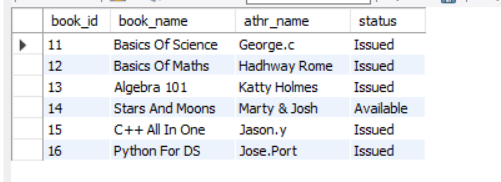
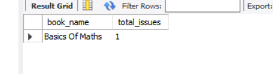

# college_management_database

# Tools & Library Used
  

## Query Task

Q 1    "List all students with books they have issued?"

  

Q 2   " students who have NOT issued any books?"

  

 Q 3   "List all books with their authors and issue status ?"

   

 Q 4   "which students issued books from which branch ?"

    

 Q  5   "books that have never been issued ?"

   

 Q  6  "the latest book issued by each student ?"

 
   

Q  7   "students who have issued books but don’t have a login account?"

   

 Q  8  "which book is issued the most?"

    
 

